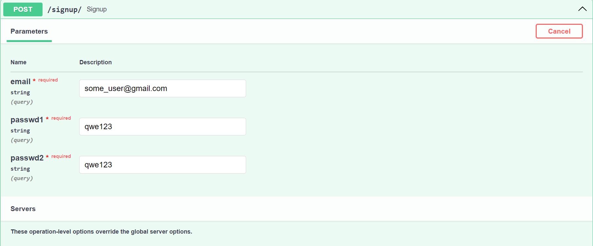
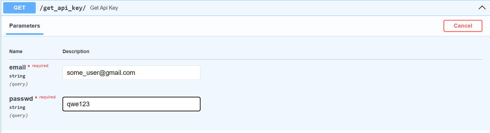
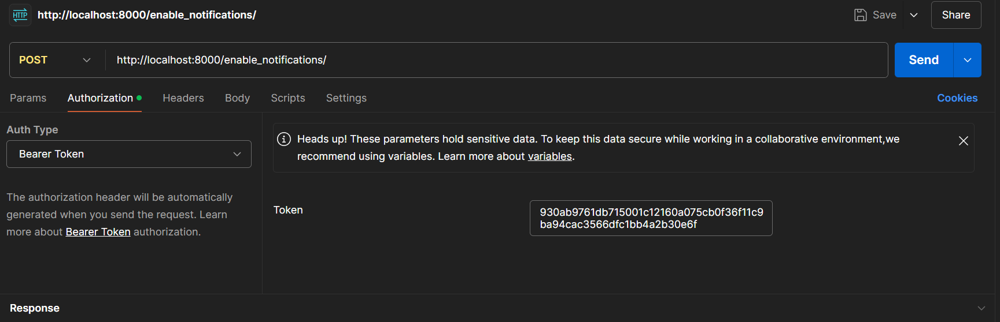
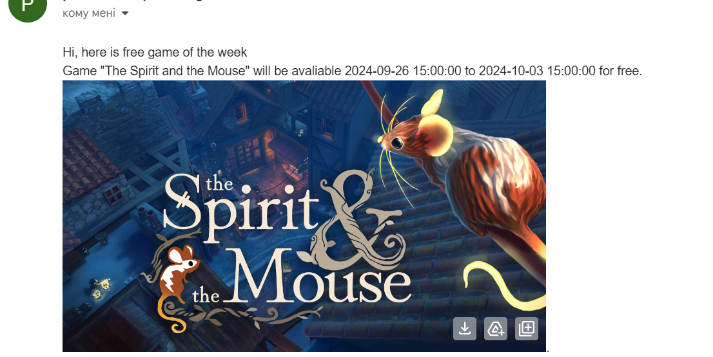

# Free Epic Games

## Fnctionality:
This service will notifice you about new free games that 
are avaliable in Epic Games currently.

## Endpoints:

### 1.Signup
To get your api key you should register input your email
and password 

### 2. Get your api key
You should input email and password to authorize yourself and get your api key

### 3. Enable/disable notifications
You should enable notifications so emails were send to you. You should input your 
api key in authorization.

### 4. Example of email: 
It's example of email 

## Technical details

### Stack: 
- **FastAPI:** used to create some endpoints so user could enable/disable notifications
- **Requests:** used to scrap data about free games
- **Cronjobs:** used to run scripts every week to gather information about games and send emails
- **SqlAlchemy:** ORM for work with database
- **bcrypt:** To hash user's passwords in database

## Setup

### 1. Clone repository
`git clone https://github.com/pshkravets/free_games.git`

### 2. Start container
`docker-compose up`