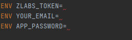

Hello everyone!  
And here you can see how to set up a project:  
`git clone https://github.com/pshkravets/free_games_email.git`  
Come to our Dockerfile and change: 
`ENV ZLABS_TOKEN=Tocken you can get from Zylalabs`  
`ENV YOUR_EMAIL=Your email`  
`ENV APP_PASSWORD=App password to google account`  

Come to directory where is docker-compose.yml  
`docker-compose up` 

Link for ZylaLabs: https://zylalabs.com/api-marketplace/video+games/complimentary+epic+games+api/2649